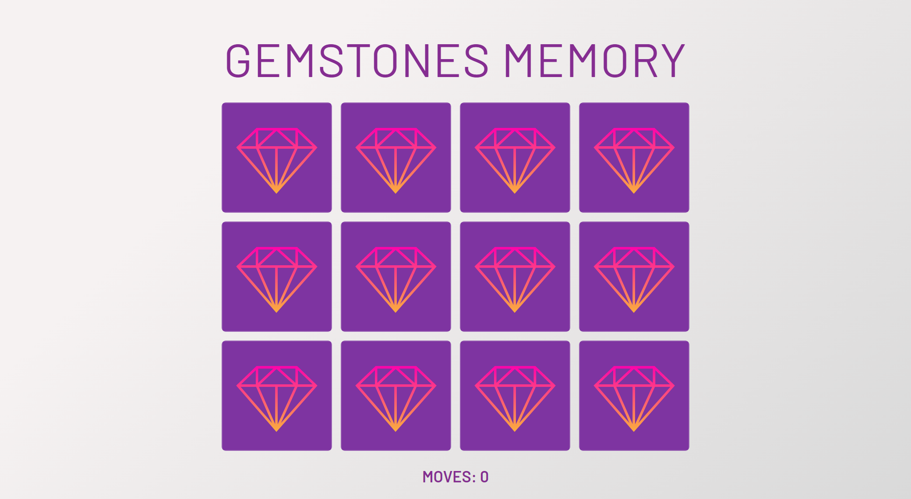

# Gemstone memory game

Memory games improve short-term memory and increase speed recognition skills.

## Table of contents

- [Overview](#overview)
  - [How to play](#how-to-play)
  - [Screenshot](#screenshot)
  - [Links](#links)
  - [Built with](#built-with)
- [Author](#author)

## Overview

### How to play

The game board consists of twelve cards arranged randomly in a grid. The deck is made up of six different pairs of cards, each with different gemstones on one side.

Turn over two cards to get started. Try to match all the pairs in as few moves as possible.

### Screenshot

### Links

- Solution URL: [Solution](https://github.com/monika-drozdz/gemstones-memory-game)
- Live Site URL: [Preview Site](https://monika-drozdz.github.io/gemstones-memory-game)

### Built with

- Semantic HTML5 markup
- CSS custom properties
- CSS grid layout
- JavaScript
- jQuery
- Figma 

## Author

- GitHub - [@monika-drozdz](https://github.com/monika-drozdz)
- Frontend Mentor - [@monika-drozdz](https://www.frontendmentor.io/profile/monika-drozdz)

